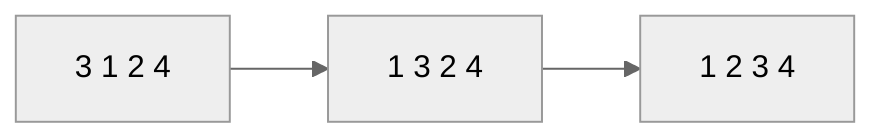
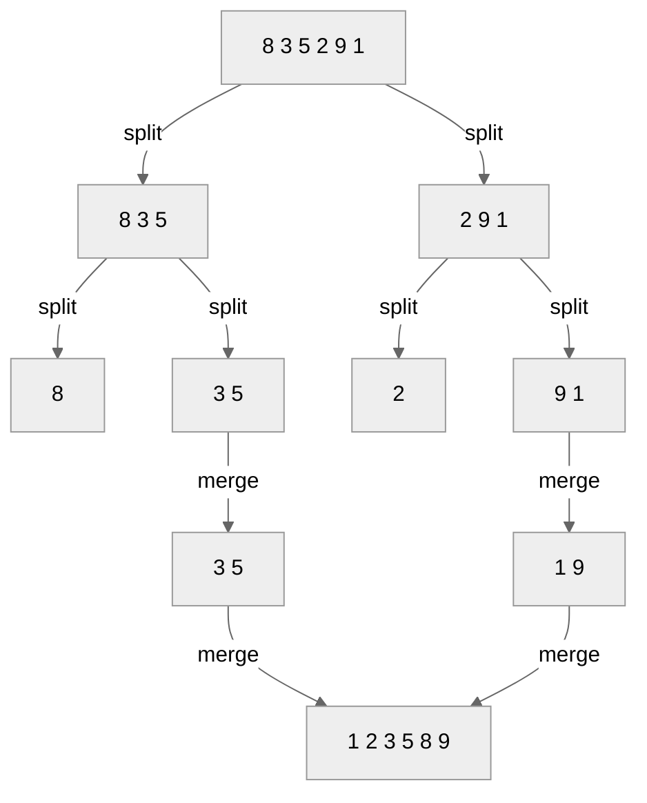
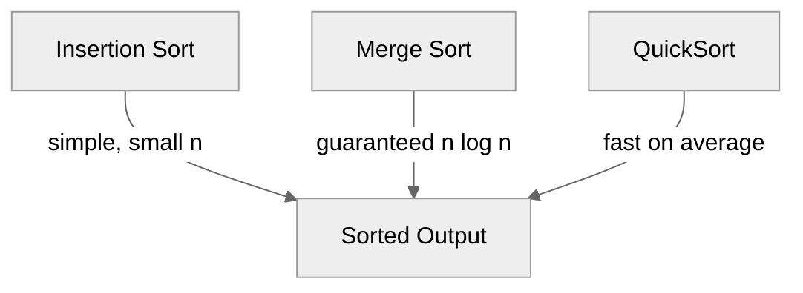

# 🧮 Algorithms Refresher  
## Sorting Algorithms

**Insertion Sort · Merge Sort · QuickSort**

---

# 🎯 Lesson Goals

- Refresh key sorting algorithms:
  - **Insertion Sort**
  - **Merge Sort**
  - **QuickSort**
- Understand:
  - Basic idea
  - Step-by-step process
  - Time complexity
  - When to use each

---

# 📥 Insertion Sort — Idea

- Works like sorting playing cards in your hand.
- Builds the sorted list one element at a time.
- Each new element is **inserted** into its correct position in the already sorted portion.

---

# 🧩 Insertion Sort — Pseudocode

```text
for i = 1 to n-1:
    key = A[i]
    j = i - 1
    while j >= 0 and A[j] > key:
        A[j+1] = A[j]
        j = j - 1
    A[j+1] = key
```

---

# 🖼️ Insertion Sort — Visualization



Step-by-step:
1. Insert `1` before `3` → `[1,3,2,4]`
2. Insert `2` before `3` → `[1,2,3,4]`
3. `4` already in place.

---

# ⏱️ Insertion Sort — Analysis

| Case | Comparisons | Time Complexity |
|------|--------------|----------------|
| Best (sorted input) | n-1 | **O(n)** |
| Average | ~n²/4 | **O(n²)** |
| Worst (reversed) | n²/2 | **O(n²)** |

✅ Simple, adaptive, in-place.  
❌ Slow for large datasets.

---

# ⚙️ Merge Sort — Idea

- **Divide and Conquer**:
  1. Divide the list into halves.
  2. Recursively sort each half.
  3. Merge the two sorted halves.

---

# 🧩 Merge Sort — Pseudocode

```text
merge_sort(A):
    if len(A) <= 1:
        return A
    mid = len(A) // 2
    left = merge_sort(A[:mid])
    right = merge_sort(A[mid:])
    return merge(left, right)
```

---

# 🔗 Merge Step — Visualization



---

# ⏱️ Merge Sort — Analysis

| Case | Time Complexity | Space |
|------|------------------|--------|
| Best | O(n log n) | O(n) |
| Average | O(n log n) | O(n) |
| Worst | O(n log n) | O(n) |

✅ Guaranteed O(n log n).  
❌ Requires extra space.  
📦 Stable and predictable.

---

# ⚡ QuickSort — Idea

- Also **Divide and Conquer**, but smarter splitting:
  1. Choose a **pivot**.
  2. Partition array into:
     - smaller than pivot
     - pivot
     - larger than pivot
  3. Recursively sort the partitions.

---

# 🧩 QuickSort — Pseudocode

```text
quick_sort(A, low, high):
    if low < high:
        p = partition(A, low, high)
        quick_sort(A, low, p-1)
        quick_sort(A, p+1, high)
```

---

# 🔀 Partitioning — Visualization

```mermaid
%%{init: {'theme': 'neutral'}}%%
graph LR
  A1[5 2 9 1 5 6] -->|pivot=5| A2[2 1 | 5 | 9 5 6]
  A2 -->|after partition| A3[2 1 5 5 6 9]
```

---

# ⏱️ QuickSort — Analysis

| Case | Time Complexity | Notes |
|------|------------------|--------|
| Best | O(n log n) | balanced splits |
| Average | O(n log n) | expected |
| Worst | O(n²) | unbalanced (e.g. sorted input with bad pivot) |

✅ Fast in practice, in-place.  
❌ Unstable; needs good pivot strategy.

---

# 🎯 Summary — Sorting Algorithms

| Algorithm | Best | Average | Worst | Stable | In-place |
|------------|-------|----------|--------|----------|-----------|
| Insertion | O(n) | O(n²) | O(n²) | ✅ | ✅ |
| Merge | O(n log n) | O(n log n) | O(n log n) | ✅ | ❌ |
| Quick | O(n log n) | O(n log n) | O(n²) | ❌ | ✅ |

---

# 💡 Visual Comparison



---

# 🧠 Key Takeaways

- **Insertion Sort** — simple, good for small or nearly sorted data.  
- **Merge Sort** — consistent, stable, predictable.  
- **QuickSort** — usually fastest, in-place.

---

# 🧩 Exercises — Conceptual

1. What makes Merge Sort’s time complexity always O(n log n)?  
2. Why does QuickSort’s performance degrade for already sorted input?  
3. For small arrays (n < 10), which algorithm would you use and why?  
4. Which algorithm is stable, and why does stability matter?  

---

# 🧮 Exercises — Practical

### 1. Trace Insertion Sort on:
`[8, 3, 5, 4, 6]`  
Show each step of the insertion.

### 2. Trace Merge Sort on:
`[7, 2, 9, 4]`  
Show the recursive splits and merges.

### 3. QuickSort Partitioning
Given `[4, 9, 2, 6, 1, 5]` and pivot = 4,  
show the partitioned array after one partition step.

---

# 🏁 End of Lesson

✅ Reviewed: Insertion, Merge, QuickSort  
🧩 Practiced: tracing and analysis  
📘 Next: **Lower bounds of sorting** and **non-comparison sorts**.

---
